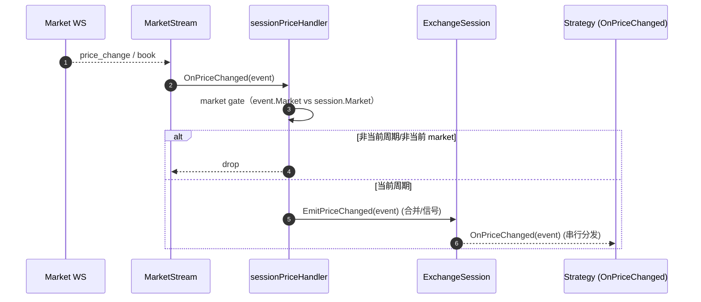
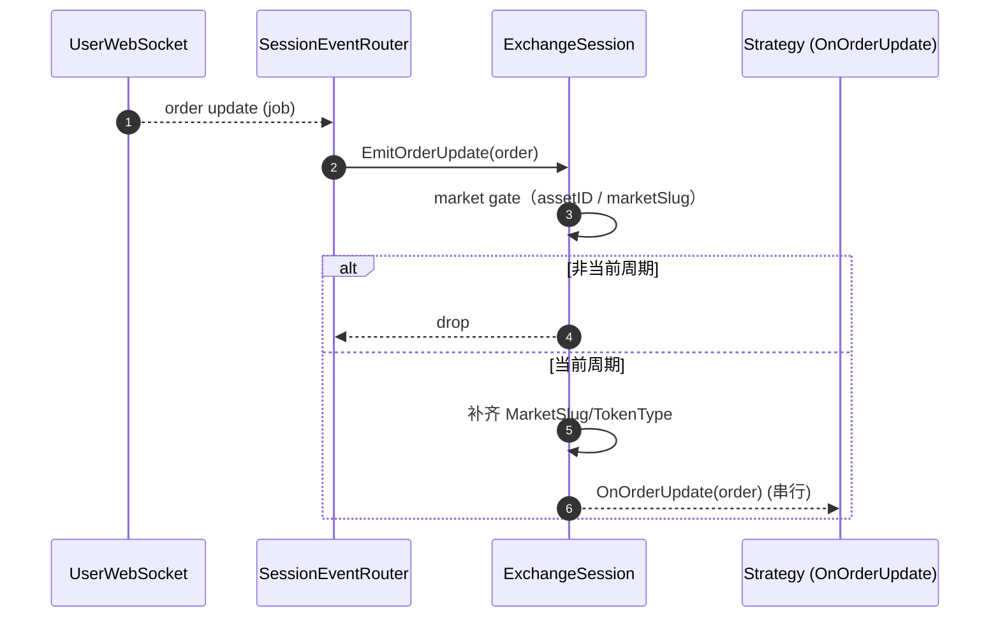
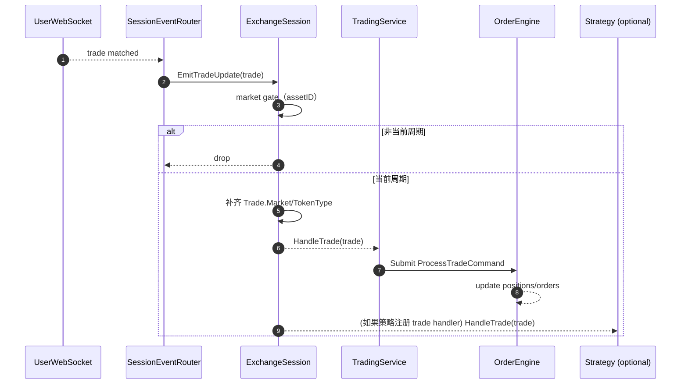
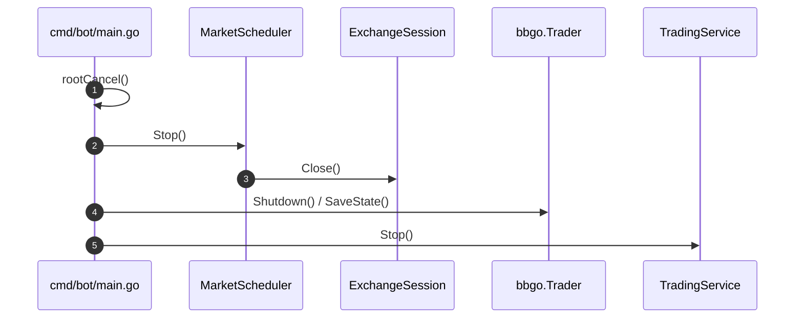

# 系统全流程梳理 & 架构风险清单（端到端）

> 目标：把“新周期=全新世界（订单/仓位/事件不串周期）”作为架构硬约束落实到系统全链路。
>
> 本文基于当前代码（`/workspace`）的真实调用路径整理，含关键时序图与剩余风险清单。

## 1. 核心组件与职责（按层）

### 1.1 运行时编排层（Runtime / Orchestration）

- **`cmd/bot/main.go`**
  - 初始化配置、日志、代理环境变量
  - 构建基础服务：`MarketDataService`、`TradingService`、`Environment`、`Trader`
  - 启动 **`MarketScheduler`**，并设置 session 切换回调
  - 通过 **`SessionEventRouter`** 把用户 WS 的订单/成交事件路由到“当前 Session”

- **`pkg/bbgo/market_scheduler.go`**
  - 负责按 15m 周期生成 market slug、拉取 market 信息、创建新 `ExchangeSession`
  - 结束旧周期时关闭旧 session（触发 MarketStream 关闭、handlers 清空）
  - 触发 `OnSessionSwitch` 回调通知上层切换策略运行环境

- **`pkg/bbgo/trader.go`**
  - 管理策略生命周期：`Subscribe`（注册回调）与 `Run`
  - 周期切换：`SwitchSession` 会 cancel 上一轮 `Run` 并对新 session 重新 Subscribe + Run

### 1.2 Session/Stream 层（事件分发与隔离）

- **`pkg/bbgo/session.go`**
  - `ExchangeSession` 聚合 `MarketDataStream` 和 `UserDataStream`
  - **价格事件：**`sessionPriceHandler` 把 `MarketStream` 事件转发到 session，并做 **market gate**
  - **订单/成交事件：**`EmitOrderUpdate` / `EmitTradeUpdate` 做 **market gate + 补齐字段**
    - 订单：补齐 `MarketSlug`/`TokenType`
    - 成交：补齐 `Trade.Market`/`Trade.TokenType`

- **`internal/infrastructure/websocket/market_stream.go`**
  - 连接 Polymarket market WS
  - 订阅 YES/NO asset 并解析 `price_change`（或 `book` 兼容）
  - 通过 `handlers.Emit` 发出 `PriceChangedEvent`
  - 关闭时先 `handlers.Clear()` 再关闭连接，降低延迟消息误投递

- **`internal/infrastructure/websocket/user.go`**
  - 连接 Polymarket user WS
  - 解析 order / trade 事件
  - 使用有界队列 + 固定 worker 分发 handlers（避免“每条消息起 goroutine”）

- **`pkg/bbgo/session_event_router.go`**
  - 一个“只注册一次”的路由器：周期切换只调用 `SetSession(newSession)`
  - 将 user WS 的 order / trade 事件统一投递到 `ExchangeSession.Emit*`（由 session gate 确保不串周期）

### 1.3 交易核心层（TradingService / OrderEngine）

- **`internal/services/trading.go`**
  - 对外 facade：下单、撤单、持仓、同步、快照
  - `SetCurrentMarket` 作为“周期切换入口”：
    - 触发 **OrderEngine 周期重置**（清空 orders/positions/pendingTrades）
    - 清空 `orderStatusCache` 与 `inFlightDeduper`

- **`internal/services/order_engine.go`**
  - Actor 模型：唯一 `cmdChan` 入口，单 goroutine 顺序更新状态
  - 管理：余额、open orders、order store、positions、pending trades
  - 新增：`CmdResetCycle` / `ResetForNewCycle` 用于周期切换的“状态硬清空”

### 1.4 持久化/恢复层（Snapshot）

- **`internal/services/trading_snapshot.go`**
  - 保存：balance/openOrders/positions
  - 恢复：
    - 订单：只恢复当前 `currentMarketSlug`
    - 仓位：已改为只恢复当前 `currentMarketSlug`（避免跨周期仓位带入）

### 1.5 策略层（Strategies）

策略示例（非穷举）：
- `internal/strategies/datarecorder/*`：数据记录、目标价获取
- `internal/strategies/grid/*`、`arbitrage/*`、`momentum/*` 等

> 当前架构目标：**策略不再承担“旧周期过滤/重置”的职责**。周期隔离必须在 Session/TradingService 层完成。

---

## 2. 全链路时序图（Mermaid）

> 说明：以下时序图以当前实现为准，关键点是 “gate + reset” 的位置。

### 2.1 启动流程（boot）

```mermaid
sequenceDiagram
  autonumber
  participant Main as cmd/bot/main.go
  participant Env as bbgo.Environment
  participant MS as bbgo.MarketScheduler
  participant MDS as MarketDataService
  participant Sess as ExchangeSession
  participant MStream as MarketStream
  participant UWS as UserWebSocket
  participant Router as SessionEventRouter
  participant TS as TradingService
  participant Trader as bbgo.Trader

  Main->>MDS: Start()
  Main->>TS: NewTradingService(); Start() via Env
  Main->>MS: Start(rootCtx)
  MS->>MDS: FetchMarketInfo(currentSlug)
  MS->>Sess: createSession(); SetMarket(market)
  Sess->>MStream: OnPriceChanged(sessionPriceHandler)
  Sess->>MStream: Connect(ctx, market)
  MS->>UWS: Connect(ctx, creds, proxy) (async)

  Main->>Router: SetSession(currentSession)
  Main->>TS: OnOrderUpdate(Router) (注册一次)
  Main->>UWS: OnOrderUpdate(Router)
  Main->>UWS: OnTradeUpdate(Router)
  Main->>Sess: OnTradeUpdate(TS) (trade 必须经 Session gate)

  Main->>TS: SetCurrentMarket(marketSlug)
  Main->>Trader: StartWithSession(rootCtx, Sess)
```

### 2.2 行情事件（market price -> strategy）



### 2.3 用户订单事件（user ws -> strategy）



### 2.4 成交事件（user ws -> trading core + strategy）



### 2.5 周期切换（最关键：新周期=全新世界）

```mermaid
sequenceDiagram
  autonumber
  participant MS as MarketScheduler
  participant OldSess as Old ExchangeSession
  participant NewSess as New ExchangeSession
  participant TS as TradingService
  participant OE as OrderEngine
  participant Trader as bbgo.Trader
  participant Router as SessionEventRouter

  MS->>OldSess: Close() (handlers.Clear + close ws)
  MS->>NewSess: createSession(); Connect(newMarket)
  MS-->>MS: callback OnSessionSwitch(old, new, market)

  MS->>TS: SetCurrentMarket(newSlug)
  TS->>OE: ResetForNewCycle(newSlug) (清空 orders/positions/pendingTrades)
  TS-->>TS: 清空 orderStatusCache / inFlightDeduper

  MS->>Router: SetSession(NewSess) (指针更新，无重复注册)
  MS->>Trader: SwitchSession(rootCtx, NewSess) (cancel old run + restart)
```

### 2.6 停机流程（shutdown）



---

## 3. 现存架构风险（重点 + 影响 + 建议）

> 这里列的是“即便我们已经做了 gate/reset 仍然可能出事”的点，按风险优先级排序。

### 3.1 交易所侧残留挂单（非本系统、或本系统重启前遗留）

- **现象/影响**
  - 本地已 reset，但交易所仍挂着旧单，会造成实际成交/占用资金，影响新周期策略表现与风控。
- **当前策略**
  - 你要求：撤单由策略负责。
- **已提供能力**
  - `TradingService.CancelExchangeOpenOrders(ctx, opt)`：可按 market/asset 过滤，且支持 `OnlyUntracked` 仅撤“他部挂单/未追踪挂单”。
- **建议**
  - 在策略 OnStart/OnCycleStart 执行：先调用该接口做收敛（并记录报告）。

### 3.2 “MarketSlug/AssetID” 作为跨周期隔离的唯一真相

- **现象/影响**
  - 若上游消息缺失 assetID（或解析错误），gate 无法准确过滤。
- **现状**
  - 价格事件来自 `MarketStream` 已携带 market + asset 映射；订单/成交来自 user WS 都有 `asset_id`。
- **建议**
  - 给 user WS 解析增加更多诊断：若出现空 assetID，直接 warn 并丢弃。

### 3.3 周期切换的并发竞态（回调顺序与时机）

- **现象/影响**
  - 极端情况下：新 session 已开始接收事件，但上层还没 SetCurrentMarket/ResetForNewCycle；导致短窗口内“新周期事件进入旧状态机”。
- **现状**
  - 通过 Session gate（按当前 session.market）已能隔离大多数串周期；
  - 但 TradingService 的 Reset 与事件流仍存在时间窗。
- **建议**
  - 进一步做“切换屏障”：在 OnSessionSwitch 内固定顺序执行：
    1) `SetCurrentMarket`（触发 reset）
    2) 更新 Router 指针
    3) `Trader.SwitchSession`
  - 并给 `SessionEventRouter` 增加可选的“enabled/disabled”闸门（切换时短暂禁用）——如后续需要更强一致性。

### 3.4 OrderEngine reset 与并发 IO 回流（place/cancel async 回调）

- **现象/影响**
  - reset 之后，旧周期的异步 IO 回调仍可能提交 `UpdateOrderCommand` 回流，污染新周期状态。
- **现状（高风险）**
  - 已修复：引入 **generation/cycle token**，所有写入 OrderEngine 的命令都携带 `Gen`；OrderEngine 对 `Gen` 严格校验，不匹配直接丢弃（Place/Cancel 会返回错误）。
  - 覆盖范围：`Place/Cancel/UpdateOrder/ProcessTrade/CreatePosition/UpdatePosition/ClosePosition` 以及 IO 回流与对账回流。
  - 结果：周期切换后，旧周期的异步回流无法再污染新周期 state。

### 3.5 Snapshot 与重启恢复的一致性边界

- **现象/影响**
  - 快照保存时机与周期切换并发，可能保存到“半旧半新”的状态。
- **现状**
  - 恢复时已按 `currentMarketSlug` 过滤订单与仓位，显著降低风险。
- **建议**
  - 快照 store 按 `marketSlug` 分桶（`snapshot/<marketSlug>`）会更干净；
  - 或在 snapshot 中写入 `marketSlug` + `generation`，恢复时强校验。

### 3.6 限流与背压（WS 分发队列满 / API 调用频繁）

- **现象/影响**
  - `UserWebSocket` 的 `orderUpdateC/tradeUpdateC` 满会丢事件；丢事件会导致状态不同步。
- **建议**
  - 对关键事件（trade、filled）采用“丢弃后补偿”机制：触发一次主动对账（拉 open orders / fills）。
  - 对丢弃计数做 metrics/报警。

---

## 4. 当前“强约束”总结（你关心的点）

- **策略层不应负责跨周期过滤**
  - 价格：Session gate
  - 订单/成交：Session gate + 字段补齐
- **周期切换后本地状态必须归零**
  - `TradingService.SetCurrentMarket` 触发 OrderEngine reset + cache/deduper 清空
- **交易所侧挂单由策略决定是否撤**
  - 已提供 `CancelExchangeOpenOrders` 接口

---

## 5. 建议的下一步（最值的 2 项）

1) **把 snapshot 分桶到 marketSlug/generation**（让重启恢复更严格、更可审计）
2) **为 WS 分发队列丢弃增加“补偿对账”**（trade/fill 丢弃触发一次 API 对账，避免静默失真）

