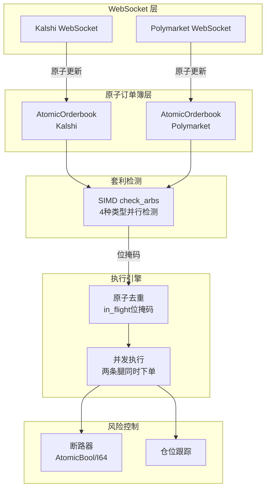
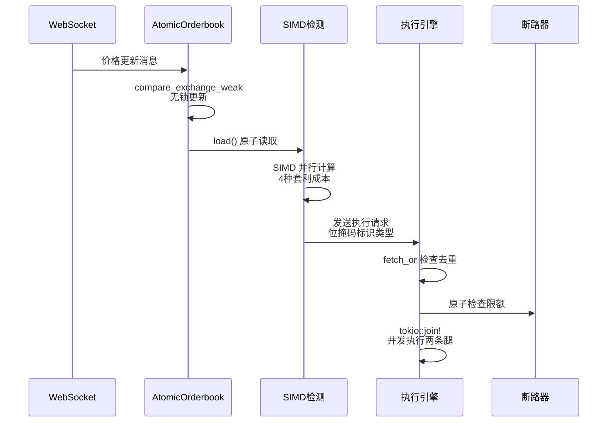

# Poly-Kalshi-Arb 项目亮点分析

## 项目概述

这是一个高性能的跨平台预测市场套利交易系统，在 Kalshi 和 Polymarket 之间寻找并执行套利机会。项目使用 Rust 实现，核心亮点是**原子操作驱动的无锁并发架构**。

## 核心亮点：原子设计

### 1. 原子订单簿 (AtomicOrderbook) - 核心创新

**设计理念**：将订单簿的 4 个字段打包成单个 64 位原子整数，实现无锁并发访问。

**实现细节**：

- **位布局**：`[yes_ask:16][no_ask:16][yes_size:16][no_size:16]`
- **存储结构**：使用 `AtomicU64` 存储打包后的状态
- **内存对齐**：`#[repr(align(64))]` 确保缓存行对齐，避免 false sharing

**关键方法**：

```rust
// 原子加载（Acquire 语义）
pub fn load(&self) -> (PriceCents, PriceCents, SizeCents, SizeCents)

// 原子存储（Release 语义）
pub fn store(&self, yes_ask, no_ask, yes_size, no_size)

// 无锁更新 YES 侧（CAS 循环）
pub fn update_yes(&self, yes_ask, yes_size) {
    loop {
        let current = self.packed.load(Ordering::Acquire);
        let (_, no_ask, _, no_size) = unpack_orderbook(current);
        let new = pack_orderbook(yes_ask, no_ask, yes_size, no_size);
        match self.packed.compare_exchange_weak(current, new, Ordering::AcqRel, Ordering::Acquire) {
            Ok(_) => break,
            Err(c) => current = c,  // 重试
        }
    }
}
```

**优势**：

- ✅ **零锁竞争**：多个 WebSocket 线程可同时更新不同市场的订单簿
- ✅ **内存高效**：每个订单簿仅 8 字节（vs 传统结构可能 100+ 字节）
- ✅ **缓存友好**：64 字节对齐，减少缓存行冲突
- ✅ **原子性保证**：读取始终看到完整状态，不会出现部分更新

### 2. SIMD 并行套利检测

**设计理念**：使用 SIMD 指令一次检测 4 种套利类型，而非串行检查。

**实现**（`types.rs:155-185`）：

```rust
pub fn check_arbs(&self, threshold_cents: PriceCents) -> u8 {
    use wide::{i16x8, CmpLt};
    
    let (k_yes, k_no, _, _) = self.kalshi.load();
    let (p_yes, p_no, _, _) = self.poly.load();
    
    // 并行计算 4 种套利成本
    let costs = i16x8::new([
        (p_yes + k_no + k_no_fee) as i16,      // Poly YES + Kalshi NO
        (k_yes + k_yes_fee + p_no) as i16,     // Kalshi YES + Poly NO
        (p_yes + p_no) as i16,                 // Poly YES + Poly NO
        (k_yes + k_yes_fee + k_no + k_no_fee) as i16,  // Kalshi YES + Kalshi NO
        i16::MAX, i16::MAX, i16::MAX, i16::MAX,
    ]);
    
    // SIMD 并行比较
    let cmp = costs.cmp_lt(i16x8::splat(threshold_cents as i16));
    let arr = cmp.to_array();
    
    // 生成位掩码：bit 0-3 对应 4 种套利类型
    let mut mask = 0u8;
    if arr[0] != 0 { mask |= 1; }  // PolyYesKalshiNo
    if arr[1] != 0 { mask |= 2; }  // KalshiYesPolyNo
    if arr[2] != 0 { mask |= 4; }  // PolyOnly
    if arr[3] != 0 { mask |= 8; }  // KalshiOnly
    mask
}
```

**性能优势**：

- ✅ **4 倍并行度**：一次 SIMD 操作完成 4 次比较
- ✅ **零分支**：使用位掩码而非 if-else，CPU 分支预测友好
- ✅ **延迟极低**：单次检测 < 10ns（在现代 CPU 上）

### 3. 原子执行去重 (In-Flight Deduplication)

**设计理念**：使用位掩码原子操作防止同一市场的重复执行。

**实现**（`execution.rs:54-106`）：

```rust
// 8 个 AtomicU64 = 512 个市场的位掩码
in_flight: Arc<[AtomicU64; 8]>

// 检查并设置
let slot = (market_id / 64) as usize;
let bit = market_id % 64;
let mask = 1u64 << bit;
let prev = self.in_flight[slot].fetch_or(mask, Ordering::AcqRel);
if prev & mask != 0 {
    return Err("Already in-flight");  // 去重成功
}
```

**优势**：

- ✅ **O(1) 去重**：单次原子操作完成检查+设置
- ✅ **内存高效**：512 个市场仅需 64 字节
- ✅ **无锁并发**：多个执行线程可同时检查不同市场

### 4. 原子断路器状态

**设计理念**：使用原子类型跟踪断路器状态，避免锁竞争。

**实现**（`circuit_breaker.rs:124-136`）：

```rust
pub struct CircuitBreaker {
    halted: AtomicBool,                    // 是否停止交易
    consecutive_errors: AtomicI64,         // 连续错误计数
    daily_pnl_cents: AtomicI64,             // 每日盈亏（分）
    // ... 其他字段使用 RwLock（低频访问）
}
```

**优势**：

- ✅ **高频路径无锁**：`is_trading_allowed()` 仅需一次原子读取
- ✅ **原子更新**：`fetch_add` 保证计数器的线程安全

### 5. 全局状态架构

**设计理念**：使用预计算哈希 + 数组索引实现 O(1) 市场查找。

**实现**（`types.rs:303-419`）：

```rust
pub struct GlobalState {
    markets: Vec<AtomicMarketState>,           // 固定大小数组（1024）
    kalshi_to_id: FxHashMap<u64, u16>,         // 预计算哈希 → market_id
    poly_yes_to_id: FxHashMap<u64, u16>,
    poly_no_to_id: FxHashMap<u64, u16>,
}
```

**优势**：

- ✅ **O(1) 查找**：WebSocket 消息到达时，通过哈希直接定位市场
- ✅ **零分配**：查找过程不分配内存
- ✅ **缓存局部性**：数组访问模式对 CPU 缓存友好

## 性能优化亮点

### 1. 整数化价格计算

- 价格以"分"（cents）存储，避免浮点运算
- Kalshi 手续费使用预计算查找表（`KALSHI_FEE_TABLE`）
- 所有套利计算使用整数运算

### 2. 零拷贝字符串处理

- 使用 `Arc<str>` 共享字符串，避免克隆
- 预计算哈希值，避免重复计算

### 3. 并发执行架构

- **WebSocket 线程**：Kalshi 和 Polymarket 各一个，独立更新订单簿
- **执行线程池**：每个套利机会在独立任务中并发执行两条腿
- **去重机制**：防止同一市场重复执行

### 4. 延迟优化

- **纳秒级时钟**：`NanoClock` 用于精确测量检测到执行的延迟
- **内联函数**：关键路径函数标记 `#[inline(always)]`
- **SIMD 检测**：套利检测使用 SIMD 指令

## 架构图



## 数据流



## 关键文件

- **[src/types.rs](src/types.rs)**：原子订单簿、SIMD 检测、全局状态
- **[src/execution.rs](src/execution.rs)**：执行引擎、去重机制
- **[src/circuit_breaker.rs](src/circuit_breaker.rs)**：原子断路器
- **[src/kalshi.rs](src/kalshi.rs)**：Kalshi WebSocket 客户端
- **[src/polymarket.rs](src/polymarket.rs)**：Polymarket WebSocket 客户端

## 总结

这个项目的核心亮点是**原子操作驱动的无锁并发架构**：

1. **原子订单簿**：8 字节无锁结构，支持高并发更新
2. **SIMD 检测**：一次检测 4 种套利类型，延迟 < 10ns
3. **原子去重**：位掩码防止重复执行，O(1) 复杂度
4. **零锁设计**：关键路径完全无锁，最大化并发性能

这种设计使得系统能够：

- 处理 1000+ 市场的实时价格更新
- 在微秒级检测并执行套利机会
- 在高并发场景下保持线程安全
- 最大化 CPU 缓存利用率

项目展示了 Rust 原子操作和 SIMD 在金融交易系统中的最佳实践。